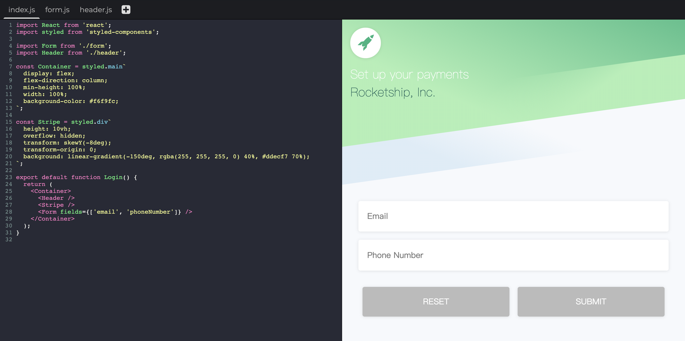
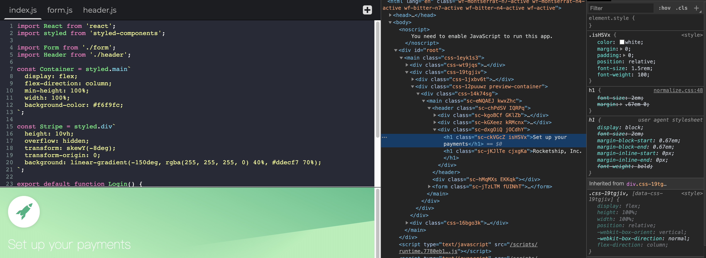
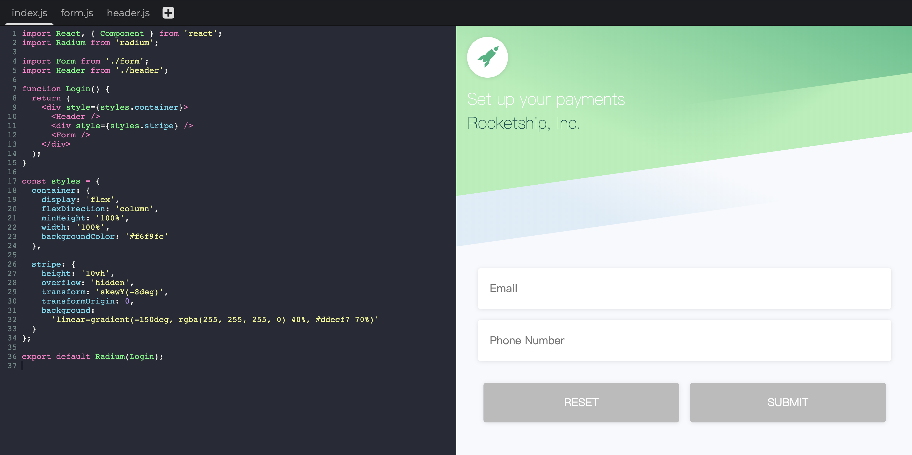
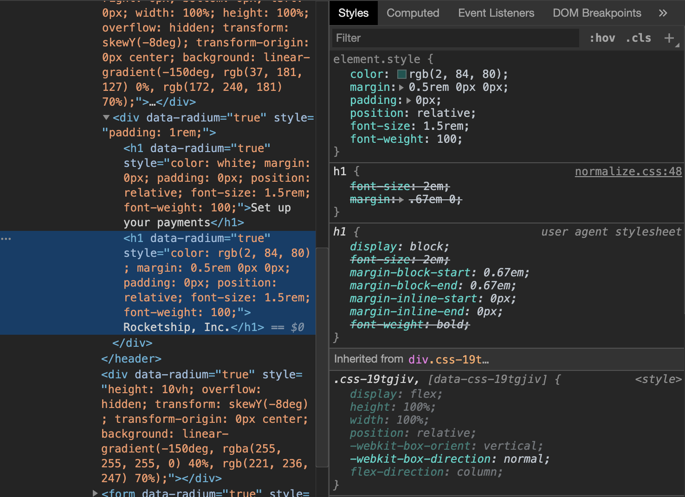

## 是什么
CSS-in-JS是一种技术（technique），而不是一个具体的库实现（library）。简单来说CSS-in-JS就是**将应用的CSS样式写在JavaScript文件里面**，而不是独立为一些`.css`，`.scss`或者`less`之类的文件，这样你就可以在CSS中使用一些属于JS的诸如模块声明，变量定义，函数调用和条件判断等语言特性来提供灵活的可扩展的样式定义。值得一提的是，虽然CSS-in-JS不是一种很新的技术，可是它在国内普及度好像并不是很高，它当初的出现是因为一些`component-based`的Web框架（例如React，Vue和Angular）的逐渐流行，使得开发者也想将组件的CSS样式也一块封装到组件中去以**解决原生CSS写法的一系列问题**。还有就是CSS-in-JS在React社区的热度是最高的，这是因为React本身不会管用户怎么去为组件定义样式的问题，而Vue和Angular都有属于框架自己的一套定义样式的方案。

本文将通过分析CSS-in-JS这项技术带来的好处以及它存在的一些问题来帮助大家判断自己是不是要在项目中使用CSS-in-JS。

## 不同的实现
实现了CSS-in-JS的库有很多，[据统计](https://github.com/MicheleBertoli/css-in-js)现在已经超过了61种。虽然每个库解决的问题都差不多，可是它们的实现方法和语法却大相径庭。从实现方法上区分大体分为两种：唯一CSS选择器和内联样式（Unique Selector VS Inline Styles）。接下来我们会分别看一下对应于这两种实现方式的两个比较有代表性的实现：[styled-components](https://www.styled-components.com/)和[radium](https://formidable.com/open-source/radium/)。

### Styled-components
[Styled-components](https://www.styled-components.com/) 应该是CSS-in-JS最热门的一个库了，到目前为止github的star数已经超过了27k。通过styled-components，你可以使用ES6的[标签模板字符串](https://developer.mozilla.org/en-US/docs/Web/JavaScript/Reference/Template_literals)语法（Tagged Templates）为需要`styled`的Component定义一系列CSS属性，当该组件的JS代码被解析执行的时候，styled-components会动态生成一个CSS选择器，并把对应的CSS样式通过style标签的形式插入到head标签里面。动态生成的CSS选择器会有一小段哈希值来保证全局唯一性来避免样式发生冲突。

[CSS-in-JS Playground](https://www.cssinjsplayground.com/)是一个可以快速尝试不同CSS-in-JS实现的网站，上面有一个简单的用styled-components实现表单的例子：



从上面的例子可以看出，styled-components不需要你为需要设置样式的DOM节点设置一个样式名，使用完标签模板字符串定义后你会得到一个styled好的Component，直接在JSX中使用这个Component就可以了。接着让我们打开DevTools查看一下生成的CSS：



从上面DevTools可以看出styled的Component样式存在于style标签内，而且选择器名字是一串随机的哈希字符串，这样其实实现了局部CSS作用域的效果（scoping styles），各个组件的样式不会发生冲突。除了styled-components，采用唯一CSS选择器做法的实现还有：[jss](https://github.com/cssinjs/jss)，[emotion](https://github.com/emotion-js/emotion)，[glamorous](https://github.com/paypal/glamorous)等。

### Radium
[Radium](https://formidable.com/open-source/radium/)是由FormidableLabs创建的在github上有超过7.2k star的CSS-in-JS库。Radium和styled-components的最大区别是它生成的是标签内联样式（inline styles）。由于标签内联样式在处理诸如`media query`以及`:hover`，`:focus`，`:active`等和浏览器状态相关的样式的时候非常不方便，所以radium为这些样式封装了一些标准的接口以及抽象。

再来看一下radium在CSS-in-JS Playground的例子：



从上面的例子可以看出radium定义样式的语法和styled-components有很大的区别，它要求你使用style属性为DOM添加相应的样式。打开DevTools查看一下radium生成的CSS：



从DevTools上面inspect的结果可以看出，radium会直接在标签内生成内联样式。内联样式相比于CSS选择器的方法有以下的优点：
* 自带局部样式作用域的效果，无需额外的操作
* 内联样式的权重（specificity）是最高的，可以避免权重冲突的烦恼
* 由于样式直接写在HTML中，十分方便开发者调试

### 其他区别
不同的CSS-in-JS实现除了生成的CSS样式和编写语法有所区别外，它们实现的功能也不尽相同，除了一些最基本的诸如CSS局部作用域的功能，下面这些功能有的实现会包含而有的却不支持：
* 自动生成浏览器引擎前缀 - built-in vendor prefix
* 支持抽取独立的CSS样式表 - extract css file
* 自带支持动画 - built-in support for animations
* 伪类 - pseudo classes
* 媒体查询 - media query
* 其他

想了解更多关于不同CSS-in-JS的对比，可以看一下Michele Bertoli整理的不同实现的[对比图](https://github.com/michelebertoli/css-in-js#features)。

## 好处
看完了一些不同的实现，大家应该对CSS-in-JS一些基本的概念和用法有了大概的理解，接着我们可以来聊一下CSS-in-JS都有什么好处和坏处了。
### 局部样式 - Scoping Styles
CSS有一个被大家诟病的问题就是没有本地作用域，所有声明的样式都是全局的（global styles）。换句话来说页面上任意元素只要匹配上某个选择器的规则，这个规则就会被应用上，而且规则和规则之间可以叠加作用（cascading）。SPA应用流行了之后这个问题变得更加突出了，因为对于SPA应用来说所有页面的样式代码都会加载到同一个环境中，样式冲突的概率会大大加大。由于这个问题的存在，我们在日常开发中会遇到以下这些问题：
* 很难为选择器起名字。为了避免和页面上其他元素的样式发生冲突，我们在起选择器名的时候一定要深思熟虑，起的名字一定不能太普通。举个例子，假如你为页面上某个作为标题的DOM节点定义一个叫做`.title`的样式名，这个类名很大概率已经或者将会和页面上的其他选择器发生冲突，所以你不得不**手动**为这个类名添加一些前缀，例如`.home-page-title`来避免这个问题。
* 团队多人合作困难。当多个人一起开发同一个项目的时候，特别是多个分支同时开发的时候，大家各自取的选择器名字可能有会冲突，可是在本地独立开发的时候这个问题几乎发现不了。当大家的代码合并到同一个分支的时候，一些样式的问题就会随之出现。

CSS-in-JS会提供**自动**局部CSS作用域的功能，你为组件定义的样式会被限制在这个组件，而不会对其他组件的样式产生影响。不同的CSS-in-JS库实现局部作用域的方法可能有所不一样，一般来说它们会通过为组件的样式生成唯一的选择器来限制CSS样式的作用域。以下是一个简化了的CSS-in-JS库生成唯一选择器的示例代码：
```javascript
const css = styleBlock => {
  const className = someHash(styleBlock);
  const styleEl = document.createElement('style');
  styleEl.textContent = `
    .${className} {
      ${styleBlock}
    }
  `;
  document.head.appendChild(styleEl);
  return className;
};
const className = css(`
  color: red;
  padding: 20px;
`); // 'c23j4'
```
从上面的代码可以看出，CSS-in-JS的实现会根据定义的样式字符串生成一个唯一的CSS选择器，然后把对应的样式插入到页面头部的style标签中，styled-components使用的就是类似的方法。
### 避免无用的CSS样式堆积 - Dead Code Elimination
进行过大型Web项目开发的同学应该都有经历过这个情景：在开发新的功能或者进行代码重构的时候，由于HTML代码和CSS样式之间没有**显式的一一对应关系**，我们很难辨认出项目中哪些CSS样式代码是有用的哪些是无用的，这就导致了我们不敢轻易删除代码中可能是无用的样式。这样随着时间的推移，项目中的CSS样式只会增加而不会减少([append-only stylesheets](https://css-tricks.com/oh-no-stylesheet-grows-grows-grows-append-stylesheet-problem/)）。无用的样式代码堆积会导致以下这些问题：
* 项目变得越来越重量级，加载到浏览器的CSS样式会越来越多，会造成一定的性能影响。
* 开发者发现他们很难理解项目中的样式代码，甚至可能被大量的样式代码吓到，这就导致了开发效率的降低以及一些奇奇怪怪的样式问题的出现。

CSS-in-JS的思路就可以很好地解决这个问题。我们先来看一段styled-components的作者Max Stoiber说过的话：
> “For three years, I have styled my web apps without any .css files. Instead, I have written all the CSS in JavaScript. ... I can add, change and delete CSS without any unexpected consequences. My changes to the styling of a component will not affect anything else. If I delete a component, I delete its CSS too. No more append-only stylesheets!” – Max Stoiber
> 
Max Stoiber大体就是说由于CSS-in-JS会把样式和组件绑定在一起，当这个组件要被删除掉的时候，直接把这些代码删除掉就好了，不用担心删掉的样式代码会对项目的其他组件样式产生影响。而且由于CSS是写在JavaScript里面的，我们还可以利用JS显式的变量定义，模块引用等语言特性来追踪样式的使用情况，这大大方便了我们对样式代码的更改或者重构。

### Critical CSS
浏览器在将我们的页面呈现给用户之前一定要先完成页面引用到的CSS文件的下载和解析（download and parse），所以link标签链接的CSS资源是渲染阻塞的（render-blocking）。如果CSS文件非常大或者网络的状况很差，渲染阻塞的CSS会严重影响用户体验。针对这个问题，社区有一种优化方案就是将一些重要的CSS代码（Critical CSS）直接放在头部的style标签内，其余的CSS代码再进行异步加载，这样浏览器在解析完HTML后就可以直接渲染页面了。具体做法类似于以下代码：
```html
<html>
  <head>
    <style>
      /* critical CSS */
    </style>
    <script>asyncLoadCSS("non-critical.css")</script>
  </head>
  <body>
    ...body goes here
  </body>
</html>
```
那么如何定义Critical CSS呢？放在head标签内的CSS当然是越少越好，因为太多的内容会加大html的体积，所以我们一般把**用户需要在首屏看到的（above the fold）页面要用到的最少CSS提取为Critical CSS**。以下是示意图：


上图中above the fold的CSS就是Critical CSS，因为它们需要立即展示在用户面前。由于页面在不同的设备上展示的效果不同，对应着的Critical CSS内容也会有所差别，因此Critical CSS的提取是一个十分复杂的过程，虽然社区有很多对应的工具可是效果都差强人意。CSS-in-JS却可以很好地支持Critical CSS的生成。在CSS-in-JS中，由于CSS是和组件绑定在一起的，只有当组件挂载到页面上的时候，它们的CSS样式才会被插入到页面的style标签内，所以很容易就可以知道哪些CSS样式需要在首屏渲染的时候发送给客户端，再配合打包工具的Code Splitting功能，可以将加载到页面的代码最小化，从而达到Critical CSS的效果。换句话来说，CSS-in-JS通过增加一点加载的JS体积就可以避免另外发一次请求来获取其它的CSS文件。而且一些CSS-in-JS的实现（例如styled-components）对Critical CSS是**自动支持的**。
### 基于状态的样式定义 - State-based styling
CSS-in-JS最吸引我的地方就是它可以根据组件的状态动态地生成样式。对于SPA应用来说，特别是一些交互复杂的页面，页面的样式通常要根据组件的状态变化而发生变化。如果不使用CSS-in-JS，处理这些逻辑复杂的情况会比较麻烦。举个例子，假如你现在页面有一个圆点，它根据不同的状态展示不同的颜色，`running`的时候是绿色，`stop`的时候是红色，`ready`的时候是黄色。如果使用的是CSS modules方案你可能会写下面的代码：

`style.css`文件
```css
.circle {
  ... circle base styles
}

.healthy {
  composes: circle;
  background-color: green;
}

.stop {
  composes: circle;
  background-color: red;
}

.ready {
  composes: circle;
  background-color: 
}
```
`index.js`文件
```javascript
import React from 'react'
import styles from './style.css'

const styleLookup = {
  healthy: styles.healthy,
  stop: styles.stop,
  ready: styles.ready
}

export default ({ status }) => (
  <div
    className={styleLookup[status]}
  />
)
```
在style.css中我们使用了CSS modules的继承写法来在不同状态的CSS类中共用circle基类的样式，代码看起来十分冗余和繁琐。由于CSS-in-JS会直接将CSS样式写在JS文件里面，所以样式复用以及逻辑判断都十分方便，如果上面的例子用styled-components来写是这样的：
```javascript
import styled from 'styled-components'

const circleColorLookup = {
  healthy: 'green',
  stop: 'red',
  ready: 'yellow'
}

export default styled.div`
  ... circle base styles
  background-color: ${({ status }) => circleColorLookup[status]};
`
```
对比起来，styled-components的逻辑更加清晰和简洁，如果后面需要增加一个状态，只需要为`circleColorLookup`添加一个键值对就好，而CSS modules的写法需要同时改动style.css和index.js文件，代码不好维护和扩展。

### 封装得更好的组件库
大家在日常开发的过程中可能会封装一些组件在不同的项目中使用，如果你的组件的样式使用的CSS预处理方案和另外一个项目的预处理方案不一样，例如组件使用的是less，项目使用的是css modules，组件复用会变得很麻烦。可是如果CSS是写在JS里面的，项目想要使用封装的组件库只需要进行简单的`npm install`就可以了，非常方便。
## 坏处
**任何事物都有好的地方和坏的地方，只有对好处和坏处都了解清楚我们才能更好地做出判断。**接着我们就来说一下CSS-in-JS不好的地方吧。
### 陡峭的学习曲线 - Steep learning curve
这其实可以从两方面来说明。首先CSS-in-JS是针对component-based的框架的，这就意味着要学习CSS-in-JS你必须得学习：component-based框架（例如React），JavaScript和CSS这三样技能。其次，即使你已经会用React，JavaScript和CSS来构建SPA应用，你还要学习某个CSS-in-JS实现（例如styled-components），以及学习一种全新的基于组件定义样式的思考问题方式。我们团队在刚开始使用styled-components的时候，适应了好一段时间才学会如何用好这个库。因为学习成本比较高，在项目中引入CSS-in-JS可能会降低你们的开发效率。
### 运行时消耗 - Runtime cost
由于大多数的CSS-in-JS的库都是在动态生成CSS的。这会有两方面的影响。首先你发送到客户端的代码会包括使用到的CSS-in-JS运行时（runtime）代码，这些代码一般都不是很小，例如styled-components的runtime大小是`12.42kB min + gzip`，如果你希望你首屏加载的代码很小，你得考虑这个问题。其次大多数CSS-in-JS实现都是在客户端动态生成CSS的，这就意味着会有一定的性能代价。不同的CSS-in-JS实现由于具体的实现细节不一样，所以它们的性能也会有很大的区别，你可以通过[这个工具](http://necolas.github.io/react-native-web/benchmarks/)来查看和衡量各个实现的性能差异。
### 代码可读性差 - Unreadable class names
大多数CSS-in-JS实现会通过生成唯一的CSS选择器来达到CSS局部作用域的效果。这些自动生成的选择器会大大降低代码的可读性，给开发人员debug造成一定的影响。
### 没有统一的业界标准 - No interoperability
由于CSS-in-JS只是一种技术思路而没有一个社区统一遵循的标准和规范，所以不同实现的语法和功能可能有很大的差异。这就意味着你不能从一个实现快速地切换到另外一个实现。举个例子，假如你先在项目使用radium，可是随着项目规模的变大，你发现radium可能不适合你现在的业务，更好的解决方案应该是styled-components。可是由于写法差异巨大，这时候你要对代码进行脱胎换骨的改动才能将代码迁移到styled-components。不过令人欣慰的是，现在已经有人在制定相关的标准了，有兴趣的同学可以看一下[Interoperable Style Transfer Format](https://github.com/cssinjs/istf-spec)。

## 个人思考与总结
CSS-in-JS有好处也有坏处，我们一定要根据自己的实际情况进行衡量和取舍来确定是不是要在自己的项目中使用它。**永远不要为了使用一个技术而用一个技术**。例如在下面几种情况下你就不需要它:
* 你是前端开发的初学者： 由于CSS-in-JS的学习坡度很陡，刚开始学习Web开发的同学没必要学习，可能会有挫败感。
* 你只想制作一些功能简单的静态页面：逻辑交互不复杂的网站没有必要使用CSS-in-JS。
* 你很注重样式名的可读性以及调试体验： CSS-in-JS动态生成的选择器很影响代码的可读性，可能会降低你的调试效率。

相反如果你的应用交互逻辑复杂的话，CSS-in-JS可能会给你带来很大的开发便利，没有使用过的人十分值得一试。
## 参考文献
* [An Introduction to CSS-in-JS: Examples, Pros, and Cons](https://webdesign.tutsplus.com/articles/an-introduction-to-css-in-js-examples-pros-and-cons--cms-33574)
* [Why I Write CSS in JavaScript](https://mxstbr.com/thoughts/css-in-js)
* [Oh No! Our Stylesheet Only Grows and Grows and Grows!](https://css-tricks.com/oh-no-stylesheet-grows-grows-grows-append-stylesheet-problem/)
* [What actually is CSS-in-JS](https://medium.com/dailyjs/what-is-actually-css-in-js-f2f529a2757)
* [The tradeoffs of CSS-in-JS](https://medium.com/free-code-camp/the-tradeoffs-of-css-in-js-bee5cf926fdb)
* [9 CSS in JS Libraries you should Know in 2019](https://blog.bitsrc.io/9-css-in-js-libraries-you-should-know-in-2018-25afb4025b9b)
* [Extract Critical CSS](https://web.dev/extract-critical-css/)
