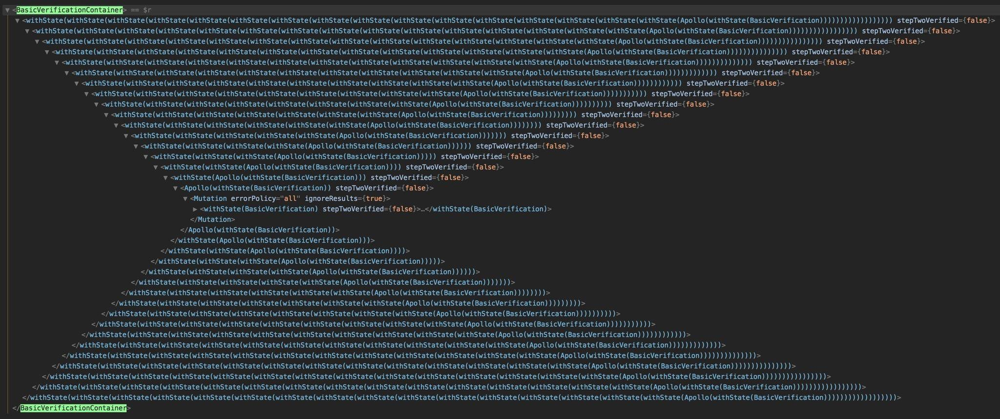

自从React 16.8发布Hook之后，笔者已经在实际项目中使用Hook快一年了，虽然Hook在使用中存在着一些坑，但是总的来说它是一个很好的功能，特别是在减少模板代码和提高代码复用率这些方面特别有用。为了让更多的人了解和使用Hook，我决定写一系列和Hook相关的文章，**本篇文章就是这个系列的第一篇**，主要和大家聊一下**React为什么需要Hook**。

## Hook解决的问题
### Component非UI逻辑复用困难
对于React或者其它的基于Component的框架来说，页面是由一个个UI组件构成的。独立的组件可以在同一个项目中甚至不同项目中进行复用，这十分有利于前端开发效率的提高。可是除了UI层面上的复用，一些**状态相关**（stateful）或者**副作用相关**（side effect）的**非UI逻辑**在不同组件之间复用起来却十分困难。对于React来说，你可以使用[高阶组件](https://reactjs.org/docs/higher-order-components.html)（High-order Component）或者[renderProps](https://reactjs.org/docs/render-props.html)的方法来复用这些逻辑，可是这两种方法都不是很好，存在各种各样的问题。如果你之前没有复用过这些非UI逻辑的话，我们可以先来看一个高阶组件的例子。

假如你在开发一个社交App的个人详情页，在这个页面中你需要获取并展示当前用户的在线状态，于是你写了一个叫做UserDetail的组件：
```javascript
class UserDetail extends React.Component {
  state = {
    isOnline: false
  }

  handleUserStatusUpdate = (isOnline) => {
    this.setState({ isOnline })
  }

  componentDidMount() {
    // 组件挂载的时候订阅用户的在线状态
    userService.subscribeUserStatus(this.props.userId, this.handleUserStatusUpdate)
  }

  componentDidUpdate(prevProps) {
    // 用户信息发生了变化
    if (prevProps.userId != this.props.userId) {
      // 取消上一个用户的状态订阅
      userService.unSubscribeUserStatus(this.props.userId, this.handleUserStatusUpdate)
      // 订阅下一个用户的状态
      userService.subscribeUserStatus(this.props.userId, this.handleUserStatusUpdate)
    }
  }

  componentWillUnmount() {
    // 组件卸载的时候取消状态订阅
    userService.unSubscribeUserStatus(this.props.userId, this.handleUserStatusUpdate)
  }

  render() {
    return (
      <UserStatus isOnline={this.state.isOnline}>
    )
  }
}
```
从上面的代码可以看出其实在UserDetail组件里面维护用户状态信息并不是一件简单的事情，我们既要在组件挂载和卸载的时候订阅和取消订阅用户的在线状态，而且还要在用户id发生变化的时候更新订阅内容。因此如果另外一个组件也需要用到用户在线状态信息的话，作为一个优秀如你的程序员肯定不想简单地对这部分逻辑进行复制和粘贴，因为**重复的代码逻辑十分不利于代码的维护和重构**。接着让我们看一下如何使用高阶组件的方法来复用这部分逻辑：
```js
// withUserStatus.jsx
const withUserStatus = (DecoratedComponent) => {
  class WrapperComponent extends React.Component {
   state = {
      isOnline: false
    }

    handleUserStatusUpdate = (isOnline) => {
      this.setState({ isOnline })
    }

    componentDidMount() {
      // 组件挂载的时候订阅用户的在线状态
      userService.subscribeUserStatus(this.props.userId, this.handleUserStatusUpdate)
    }

    componentDidUpdate(prevProps) {
      // 用户信息发生了变化
      if (prevProps.userId != this.props.userId) {
        // 取消上个用户的状态订阅
        userService.unSubscribeUserStatus(this.props.userId, this.handleUserStatusUpdate)
        // 订阅下个用户的状态
        userService.subscribeUserStatus(this.props.userId, this.handleUserStatusUpdate)
      }
    }

    componentWillUnmount() {
      // 组件卸载的时候取消状态订阅
      userService.unSubscribeUserStatus(this.props.userId, this.handleUserStatusUpdate)
    }

    render() {
      return <DecoratedComponent
        isOnline={this.stateIsOnline}
        {...this.props}
      />
    }
  }

  return WrapperComponent
}
```
在上面的代码中我们定义了用来获取用户在线状态的高阶组件，它维护了当前用户的在线状态信息并把它作为参数传递给被装饰的组件。接着我们就可以使用这个高阶组件来重构UserDetail组件的代码了：
```js
import withUserStatus from 'somewhere'

class UserDetail {
  render() {
    return <UserStatus isOnline={this.props.isOnline}>
  }
}

export default withUserStatus(UserDetail)
```
我们可以看到使用了withUserStatus高阶组件后，UserDetail组件的代码一下子变得少了很多，现在它只需要从父级组件中获取到isOnline参数进行展示就好。而且这个高阶组件可以套用在其它任何需要获取用户在线状态信息的组件上，你再也不需要在前端维护一样的代码了。

这里要注意的是上面的高阶组件封装的逻辑和UI展示没有太大关系，它维护的是用户在线状态信息的获取和更新这些和**外面世界交互的side effect**，以及**用户状态的存储**这些和**组件状态相关**的逻辑。虽然看起来似乎代码很优雅，不过使用高阶组件来封装组件的这些逻辑其实会有以下的问题：
* **高阶组件的开发对开发者不友好**：开发者（特别是初级开发者）需要花费一段时间才能搞懂其中的原理并且适应它的写法。如果你使用高阶组件已经很久了，你看到这个说法可能会有些不以为然。可是我相信你在最开始接触高阶组件的时候肯定也花了一段时间才能搞懂它的原理，而且从上面的例子来看高阶组件其实是十分笨重的。试想一下，某天你的项目来了一个React新手，估计他也得花费一段时间才能理解你写的那些高阶组件代码吧。
* **高阶组件之间组合性差**：使用过高阶组件的同学一定试过由于要为组件添加不同的功能，我们要为同一个组件嵌套多个高阶组件，例如这样的代码：`withAuth(withRouter(withUserStatus(UserDetail)))`。这种嵌套写法的高阶组件可能会导致很多问题，其中一个就是props丢失的问题，例如withAuth传递给UserDetail的某个prop可能在withUserStatus组件里面丢失或者被覆盖了。如果你使用的高阶组件都是自己写的话还好，因为调试和修改起来都比较简单，如果你使用的是第三方的库的话就很头痛了。
* **容易发生wrapper hell**：这个问题在上面嵌套多重高阶组件的时候就会出现，具体会造成我们在React Devtools查看和调试某个组件的时候十分困难。我们可以看幅图片来感受一下：

这真是高阶组件一时爽，出问题就火葬场的感觉有没有。

和高阶组件类似，renderProps也会存在同样的问题。基于这些原因，React需要一个**新的用来复用组件之间非UI逻辑的方法**，所以Hook就这么诞生了。总的来说，Hook相对于高阶组件和renderProps在复用代码逻辑方面有以下的优势：
* **写法简单**：每一个Hook都是一个函数，因此它的写法十分简单，而且开发者更容易理解。
* **组合简单**：Hook组合起来十分简单，组件只需要同时使用多个hook就可以使用到它们所有的功能。
* **容易扩展**：Hook具有很高的可扩展性，你可以通过自定义Hook来扩展某个Hook的功能。
* **没有wrapper hell**：Hook不会改变组件的层级结构，也就不会有wrapper hell问题的产生。

除了用来替代难用的HOC和renderProps来解决组件非UI逻辑复用的问题之外，其实Hook还解决了以下这些问题。

### 组件的生命周期函数不适合side effect逻辑的管理
在上面UserDetail组件中我们将`获取用户的在线状态`这个side effect的相关逻辑分散到了`componentDidMount`，`componentWillUnmount`，`componentDidUpdate`三个生命周期函数中，**这些互相关联的逻辑被分散到不同的函数中会导致bug的发生和产生数据不一致的情况**。除了这个，**我们还可能会在组件的同一个生命周期函数放置很多互不关联的side effect逻辑**。举个例子，如果我们想在用户查看某个用户的详情页面的时候将浏览器当前标签页的title改为当前用户名的话，就需要在组件的componentDidMount生命周期函数里面添加`document.title = this.props.userName`这段代码，可是这段代码和之前订阅用户状态的逻辑是互不关联的，而且随着组件的功能变得越来越复杂，这些不关联而又放在一起的代码只会变得越来越多，于是你的组件逐渐变得难以测试。由此可见Class Component的生命周期函数并不适合用来管理组件的side effect逻辑。

那么这个问题Hook又是如何解决的呢？由于每个Hook都是一个函数，所以你可以**将和某个side effect相关的逻辑都放在同一个函数（Hook）里面**（useEffect Hook）。这种做法有很多好处，首先关联的代码都放在一起，可以十分方便代码的维护，其次实现了某个side effect的Hook还可以被不同的组件进行复用来提高开发效率。举个例子，我们就可以将改变标签页title的逻辑封装在一个自定的Hook中，如果其它组件有相同逻辑的话就可以使用这个Hook了：
```js
// 自定义Hook
function useTabTitle(title) {
  React.useEffect(() => {
    document.title = title
  }, [title])
}

// UserDetail中使用useTabTitle Hook
function UserDetail = (props) => {
  useTabTitle(props.userName)
  ...
}
```
这个复用side effect的功能其实是一个十分强大的功能，你可以检查一下你现在写的项目代码，肯定有很多组件的side effect是可以封装成Hook的。封装成Hook的side effect不仅仅可以在某一个项目中使用，还可以在不同项目中复用，这对我们的开发效率肯定会有很大的提升。

### 不友好的Class Component
其实Class Component除了生命周期函数不适合side effect的管理之外，还有一些其它的问题。

首先Class Component对开发者不友好。如果你要使用Class Component首先你得理解JS里面的this是怎么使用的，它的使用方法其实和其他语言有很大的区别。由于JS本身的原因，在Class Component中你要手动为注册的event listener绑定this，不然就会报`this is undefined`的错误，早期的React玩家肯定体验过每个事件监听函数都要手动绑定this的酸爽感觉，乏味而且容易引发bug，这个问题直到[class properties](https://babeljs.io/docs/en/babel-plugin-proposal-class-properties)出来之后才有所改善。
```js
class UserDetail extends React.Component {
  constructor(props) {
    super(props)
    this.handlerUserStatusUpdate = this.handleUserStatusUpdate.bind(this)
    ...
  }
}
```

除了对开发者不友好，Class Component对机器也很不友好。例如Class Component的生命周期函数很难被minified。其次，Class Component的存在可能会阻碍React后面的发展。举个例子，随着新的理念 - Compiler as Framework的兴起，一些诸如[Svelte](https://svelte.dev/), [Angular](https://angular.io/)和[Glimmer](https://glimmerjs.com/)的框架将框架的概念放到了编译时以去除production code里面的runtime代码来加快应用的首屏加载速度，这个方案已经开始被逐渐采纳了，而且未来有可能会成为潮流。如果大家不是很了解Compiler as Framework理念的话，可以看我的另外一篇文章：[Svelte 3 初学者完全指南](https://superseany.com/2019/12/17/Svelte-3-%E5%88%9D%E5%AD%A6%E8%80%85%E5%AE%8C%E5%85%A8%E6%8C%87%E5%8D%97/)。React已经存在了5年，它如果想要继续存在多五年的话也要跟上这个潮流，出于这个原因，React团队和[Prepack](https://prepack.io/)团队进行了一些和Compiler as Framework相关的尝试，而且就目前实验的结果来说这个思路有很大的想象空间。不过在这个过程中React的开发者也发现了一个严重的问题，那就是开发者可能会以一种非常规的模式来使用Class Component，而这些模式会降低这个方案带来的优化效果。

因此React要想得到进一步的发展的话，就必须让开发者更多地使用Function Component而不是Class Component。而开发者偏向于使用Class Component而不是Function Component的一个主要原因是Function Component没有状态管理和生命周期函数等功能。Hook出来后这个问题就不存在了，因为开发者可以使用**useState** Hook来在Function Component使用**state**以及**useEffect** Hook来实现一些和**生命周期函数类似的功能**。最重要的是，React将所有复杂的实现都封装在框架里面了，开发者无需学习函数式编程和响应式编程的概念也可以很好地使用Hook来进行开发。

## 总结
本篇文章我主要论述了React为啥要有Hook，总的来说是以下三个原因：
* Component非UI逻辑复用困难。
* 组件的生命周期函数不适合side effect逻辑的管理。
* 不友好的Class Component。

如果你有其他的补充或者觉得我有什么地方说得不对的话可以在评论区和我一起探讨，在后面一篇文章中我将会为大家深入介绍一些常用的Hook。

## 参考文献
* [React Today and Tomorrow and 90% Cleaner React With Hooks](https://www.youtube.com/watch?v=dpw9EHDh2bM)
* [React Hook RFC](https://github.com/reactjs/rfcs/pull/68)
